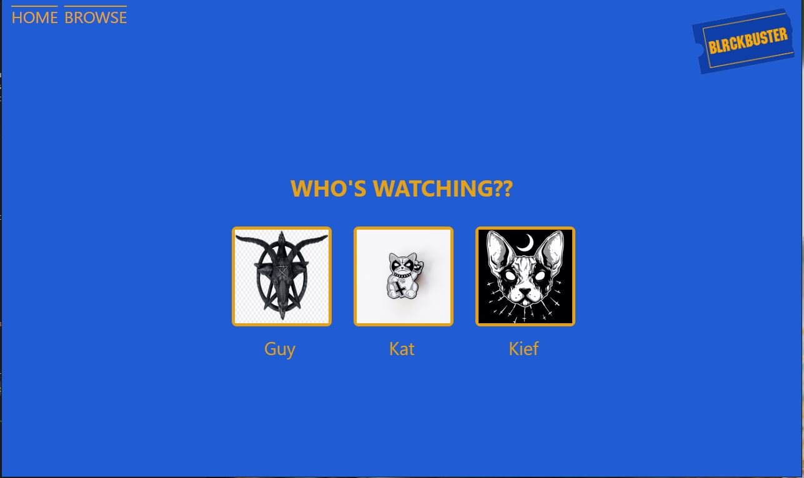
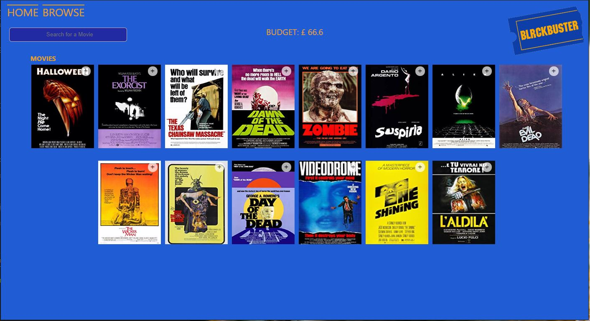
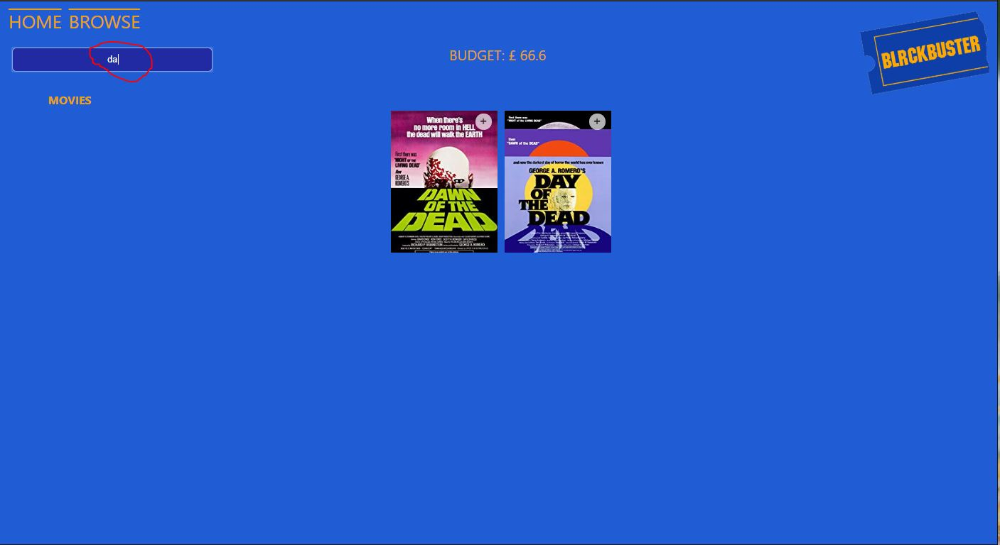
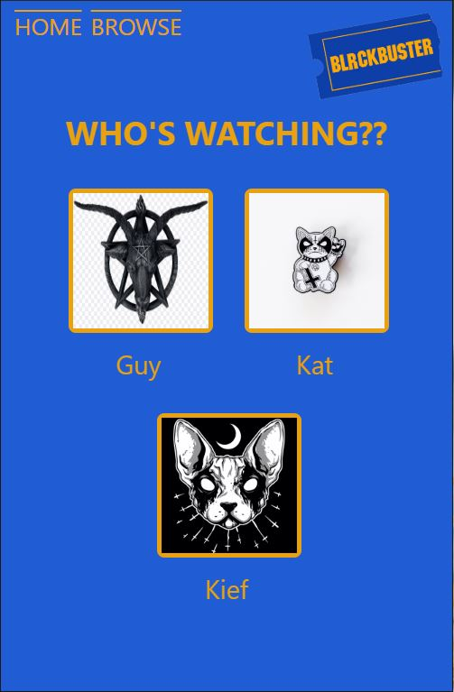
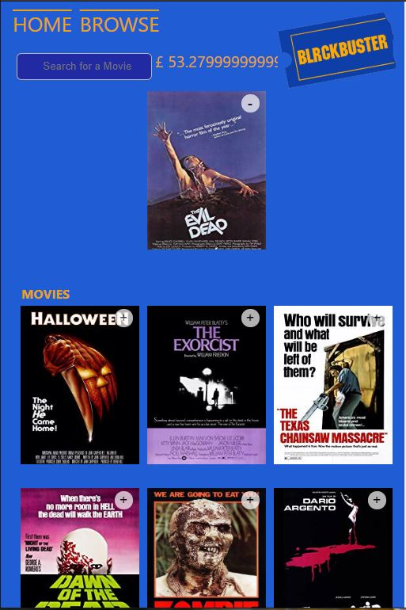

# Table Of Contents

- [Blrkbuster](#blrkbuster)
  - [Running the project](#running-the-project)
  - [Screenshots](#screenshots)
    - [Select User](#select-user)
    - [Movie Catalog](#movie-catalog)
    - [Search Filter](#search-filter)
    - [Rented Movies](#rented-movies)
    - [Movie Details](#movie-details)
    - [Mobile Responsive](#mobile-responsive)
  - [Techstack](#tech-stack)
  - [TODO](#todo)

# Blrkbuster

Blrkbuster is a front end movie rental app built with React. Users are able to choose their user and rent movies based on their budget. Each user has a unique budget. Users can also click on the movie to see more information about the movie.

Demo: https://blrkbuster.herokuapp.com/

## Running the project

1. Clone the repo.
2. Run `npm install`.
3. Run `npm start`.
4. Navigate to `http://localhost:3000` (or other port based on the message in the console).

## Screenshots

### Select User

Main screen for user to select who they are.

### Movie Catalog

A user can see their budget and all the available movies to rent.

### Search Filter

As a user searches the movie catalog filters the movie based on the name.

### Rented Movies

Once a user rents a movie/s a new 'Rented' section appears on the page showing which movies they have rented.

### Movie Details

A user can click on a movie to see more information about the movie.

### Mobile Responsive

The app if fully responsive for mobile use.

## Techstack
- React

## TODO

1. Get many movies from movie API.
2. View movies by category.
3. Create full stack with NodeJS, Express, Mongo.
